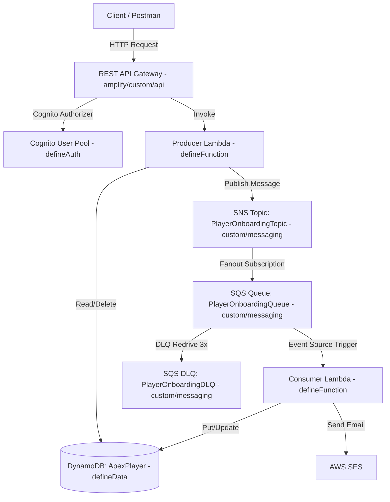

# 📖 AWS Infrastructure as Code (IaC) - Comprehensive Guide

> **Purpose:** This documentation file provides a complete technical guide, architectural breakdown, and reference source code for building an AWS backend using Amplify Gen 2 & AWS CDK v2.

---

## 🚀 0. Project Initialization (Amplify Gen 2)

To initialize an Amplify Gen 2 backend in an existing repository from scratch:

1. **Run the Amplify Gen 2 creation command:**
   ```bash
   npm create amplify@latest -- -y
   ```
2. **Standard Directory Scaffold (No S3 Storage):**
   ```text
   amplify/
   ├── auth/
   │   └── resource.ts                   # Auth definition using defineAuth
   ├── data/
   │   └── resource.ts                   # Data API definition using defineData & a.schema
   ├── functions/
   │   ├── producer-function/
   │   │   ├── resource.ts               # Function definition using defineFunction & secret
   │   │   └── handler.ts                # Lambda entrypoint handler
   │   └── consumer-function/
   │       ├── resource.ts               # Function definition using defineFunction
   │       └── handler.ts                # Lambda entrypoint handler
   ├── custom/                           # Custom CDK resources (SQS, SNS, REST API, IAM, SSM)
   │   ├── messaging/resource.ts         # SQS Queues, DLQ, & SNS Topic using CDK
   │   ├── iam/resource.ts               # Custom IAM Roles & Policy Statements
   │   ├── api/resource.ts               # Custom REST API Gateway
   │   └── ssm/resource.ts               # SSM Parameter Store
   ├── utils/                            # Reusable helper utilities
   │   ├── env.ts                        # Helper utility to resolve single ENV environment variable (develop/staging/prod)
   │   └── path.ts                       # Helper getLambdaEntry for resolving absolute Lambda handler entry paths
   ├── backend.ts                        # Main orchestrator using defineBackend & backend.createStack
   ├── package.json
   └── tsconfig.json
   .env                                  # Local environment variables file (contains secrets/local defaults, gitignored)
   .env.sample                           # Sample environment template file for reference
   ```

---

## 🏛️ 1. Architecture Overview

The backend architecture implements a **Serverless Event-Driven & Decoupled Architecture** consisting of native Amplify Gen 2 primitives (`defineAuth`, `defineData`, `defineFunction`) and custom AWS CDK v2 extensions:



---

## 📚 2. Core Technical Terminology, Primitives & Service Definition

### 2.1. Amplify Gen 2 Primitives
1. **`defineAuth`**: Amplify Gen 2 method to construct Amazon Cognito User Pool and Identity Pool with auth rules, groups, and triggers.
2. **`defineData` & `a.schema`**: Amplify Gen 2 method to generate GraphQL/AppSync Data API backed by DynamoDB models (`a.model`), custom queries (`a.query`), mutations (`a.mutation`), and Lambda handlers (`a.handler.function`).
3. **`defineFunction` & `secret`**: Amplify Gen 2 method to define Lambda functions, environment variables, timeout, and secure environment secrets managed via Amplify CLI.
4. **`defineBackend`**: Primary entry point in `amplify/backend.ts` that combines all Amplify resources and exposes `backend.createStack` for custom AWS CDK constructs.

> ⚠️ **Note on S3 Storage**: In this architecture, S3 is not used, so **`defineStorage` is omitted**, and `amplify/storage/` is excluded.

---

### 2.2. Defining SQS, SNS, & SES Services in Amplify Gen 2

> ❓ **Question:** *Are there native `defineSQS`, `defineSNS`, or `defineSES` functions in Amplify Gen 2? How are they configured?*

**Answer:**
- **NO**, Amplify Gen 2 does not provide `defineSQS`, `defineSNS`, or `defineSES` primitives.
- Amplify Gen 2 natively provides 4 core primitives: `defineAuth`, `defineData`, `defineFunction`, and `defineStorage`.
- For other AWS services (**SQS, SNS, SES, EventBridge, REST API Gateway, ECS...**), Amplify Gen 2 relies on **AWS CDK v2 (Level 2 Constructs)**.

**Configuration Standard for SQS, SNS, & SES:**
1. **SQS & SNS**: Provisioned using standard CDK L2 constructs (`aws-cdk-lib/aws_sqs`, `aws-cdk-lib/aws_sns`) in `amplify/custom/messaging/resource.ts` or via `backend.createStack('CustomMessagingStack')`.
2. **Event Source Triggering**: Bind SQS Queue to Consumer Lambda using `consumerLambda.addEventSource(new lambdaEventSources.SqsEventSource(queue))` in `amplify/backend.ts`.
3. **SES (Simple Email Service)**: Managed via AWS Console/CDK email identities. Triggered by Consumer Lambda with granted IAM permissions (`ses:SendEmail`, `ses:SendRawEmail`).

---

### 2.3. Defining IAM Roles in Amplify Gen 2

> ❓ **Question:** *What method is used to define IAM roles in Amplify Gen 2? How are they configured when paired with other resources?*

IAM Roles in Amplify Gen 2 are managed via **two primary methods**:

#### Method 1: Managed IAM Roles (Implicit)
Amplify Gen 2 primitives generate IAM roles following least privilege:
- **`defineAuth`**: Provisions `authenticatedUserIamRole` and `unauthenticatedUserIamRole` within Cognito Identity Pool.
- **`defineData`**: Provisions AppSync Execution Role for DynamoDB CRUD access based on `allow.authenticated()`, `allow.owner()`, etc.
- **`defineFunction`**: Provisions a Lambda Execution Role attached with `AWSLambdaBasicExecutionRole` for CloudWatch logging.

#### Method 2: Custom IAM Roles & Permissions via AWS CDK (Explicit)
When Lambda functions or User Roles interact with SQS, SNS, SES, or DynamoDB:

##### Option A (Recommended - CDK Grant Helpers & `.addToRolePolicy`):
Extend auto-generated L2 constructs directly in `amplify/backend.ts`:
```typescript
// 1. Grant Producer Lambda permission to publish to SNS Topic
playerOnboardingTopic.grantPublish(backend.producerFunction.resources.lambda);

// 2. Grant Consumer Lambda permission to consume messages from SQS Queue
playerOnboardingQueue.grantConsumeMessages(backend.consumerFunction.resources.lambda);

// 3. Add SES Policy Statement to Consumer Lambda execution role
backend.consumerFunction.resources.lambda.addToRolePolicy(
  new iam.PolicyStatement({
    actions: ['ses:SendEmail', 'ses:SendRawEmail'],
    resources: ['*'],
  })
);
```

##### Option B (Explicit Custom IAM Role via `new iam.Role(...)`):
Defined in custom IAM modules (`amplify/custom/iam/resource.ts`):
```typescript
import * as cdk from 'aws-cdk-lib';
import * as iam from 'aws-cdk-lib/aws-iam';

export function createProducerLambdaRole(stack: cdk.Stack, env: string, topicArn: string) {
  const role = new iam.Role(stack, 'ProducerLambdaRole', {
    roleName: `ProducerLambdaRole-${env}`,
    assumedBy: new iam.ServicePrincipal('lambda.amazonaws.com'),
    managedPolicies: [
      iam.ManagedPolicy.fromAwsManagedPolicyName('service-role/AWSLambdaBasicExecutionRole'),
    ],
  });

  role.addToPolicy(
    new iam.PolicyStatement({
      actions: ['sns:Publish'],
      resources: [topicArn],
    })
  );

  return role;
}
```

#### Resource IAM Mapping Table:
### 2.4. Distinguishing Environment Variables (.env, .env.sample) & Amplify Secrets

> ❓ **Question:** *How are non-sensitive environment variables (`ENV`) and secrets (`API_SECRET`) managed in Amplify Gen 2? What is the difference between `.env` and `secret()`?*

**1. Plain Environment Variables (.env) vs. Amplify Secrets (`secret()`):**
- **Plain Environment Variables (`.env` / `.env.sample`)**: Used for non-sensitive configuration parameters (`ENV=develop`, `AWS_REGION=us-east-1`, `TABLE_NAME`, `SQS_QUEUE_URL`, `SENDER_EMAIL`). The `.env.sample` file provides a reference template, while `.env` holds local developer config (gitignored).
- **Amplify Secrets (`secret('API_SECRET')`)**: Reserved for sensitive credentials (API Keys, Tokens, Passwords). Secrets are **NOT** stored in `.env` files or Git repositories. Instead, they are managed via the Amplify CLI:
  ```bash
  npx ampx secret set API_SECRET
  ```
  AWS Amplify encrypts and stores them in AWS SSM Parameter Store under SecureString, dynamically injecting them into Lambda execution environments upon backend deployment.

**2. Separating Utilities into `amplify/utils/env.ts`:**
To adhere to Clean Code principles and reusability, environment resolution logic is extracted into a dedicated utility module `amplify/utils/env.ts`:

```typescript
/**
 * Utility helper to determine the current environment (develop, staging, prod).
 * Default fallback: 'develop'
 */
export const getEnv = (): string => {
  return process.env.ENV || 'develop';
};
```

---

## 💻 3. Complete Infrastructure Source Code Reference (Step-by-Step Setup Workflow)

The following reference implementation follows a **step-by-step setup workflow from start to finish**. Every line of code includes **detailed inline comments explaining its meaning and rationale**:

---

### 📌 Step 3.1: Initialize Authentication Resource Configuration
- **Purpose**: Provision Amazon Cognito User Pool allowing users to sign up, log in with Email, and obtain JWT tokens to secure API calls.
- **File to create/update**: `amplify/auth/resource.ts`

```typescript
// 1. Import defineAuth primitive from Amplify Backend core library
import { defineAuth } from '@aws-amplify/backend';

// 2. Declare and export the auth object as the single authentication authority for the backend
export const auth = defineAuth({
  // 3. Configure primary login mechanism: enable user sign-in using Email address
  loginWith: {
    email: true, // Enable email login (eliminates requiring Cognito default username)
  },
  // 4. Define required user attributes during sign-up
  userAttributes: {
    preferredUsername: {
      required: true, // Mandate users to supply a display name (preferredUsername)
      mutable: true,  // Allow users to update their display name later
    },
  },
});
```

---

### 📌 Step 3.2: Provision Serverless Lambda Functions & Build Flow
- **Purpose**: Define Lambda functions pointing `entry` directly to application handler logic in `src/lambdas/`. Package handlers into standalone zip deployment artifacts using automated build script `scripts/build-lambdas.ts`.
- **Files to create/update**:
  1. Producer Lambda Resource: `amplify/functions/producer-function/resource.ts` (Set `entry` to `src/lambdas/producer/handler.ts`)
  2. Producer Handler & Controller: `src/lambdas/producer/handler.ts` & `controller.ts`
  3. Consumer Lambda Resource: `amplify/functions/consumer-function/resource.ts` (Set `entry` to `src/lambdas/consumer/handler.ts`)
  4. Consumer Handler & Processor: `src/lambdas/consumer/handler.ts` & `processor.ts`
  5. Packaging Script: `scripts/build-lambdas.ts` (Bundles and packages sources into `dist/producer.zip` & `dist/consumer.zip`)

#### 1. Producer Function Resource (`amplify/functions/producer-function/resource.ts`)
```typescript
// 1. Import defineFunction primitive and secret helper from Amplify Backend core
import { defineFunction, secret } from '@aws-amplify/backend';
// 2. Import helper utilities getEnv and getLambdaEntry from shared utils module
import { getEnv } from '../../utils/env';
import { getLambdaEntry } from '../../utils/path';

// 3. Define and export Producer Lambda Function configuration
export const producerFunction = defineFunction({
  name: 'producer-function',    // CloudFormation / AWS Console function identifier name
  entry: getLambdaEntry('producer'), // Best Practice: resolve absolute path to handler in src/lambdas/ via helper
  timeoutSeconds: 30,           // Maximum execution timeout set to 30 seconds
  environment: {                // Environment variables injected into Lambda at runtime
    ENV: getEnv(),              // Single ENV environment variable (default: develop)
    API_SECRET: secret('API_SECRET'), // Securely fetch secret from SSM Parameter Store / Amplify Secrets
  },
});
```

#### 2. Producer Function Handler (`src/lambdas/producer/handler.ts`)
```typescript
// 1. Import types and main Controller
import { ApiGatewayProxyEvent, ApiResponse } from '@shared/types';
import { ProducerController } from './controller';

const controller = new ProducerController();

// 2. Define main handler function delegating execution to Controller
export async function handler(event: ApiGatewayProxyEvent): Promise<ApiResponse> {
  return controller.handle(event);
}
```

#### 3. Consumer Function Resource (`amplify/functions/consumer-function/resource.ts`)
```typescript
// 1. Import defineFunction primitive from Amplify Gen 2 core and getLambdaEntry helper
import { defineFunction } from '@aws-amplify/backend';
import { getLambdaEntry } from '../../utils/path';

// 2. Declare and export Consumer Lambda Function configuration
export const consumerFunction = defineFunction({
  name: 'consumer-function',  // Unique function identifier for Consumer Lambda
  entry: getLambdaEntry('consumer'), // Best Practice: resolve absolute path to handler in src/lambdas/ via helper
  timeoutSeconds: 60,         // Extended 60-second timeout for processing SQS message batches
});
```

#### 4. Consumer Function Handler (`src/lambdas/consumer/handler.ts`)
```typescript
// 1. Import SQS message Processor
import { ConsumerProcessor, SqsRecordInput } from './processor';

const processor = new ConsumerProcessor();

// 2. Define async handler function for processing SQS message batches and returning batchItemFailures
export async function handler(event: { Records?: SqsRecordInput[] }) {
  const records = event.Records || [];
  const batchItemFailures = [];

  for (const record of records) {
    try {
      await processor.processRecord(record);
    } catch (err) {
      batchItemFailures.push({ itemIdentifier: record.messageId });
    }
  }

  return { batchItemFailures };
}
```

#### 5. Build Script & Zip Packaging Workflow (`scripts/build-lambdas.ts`)
Executing `npm run build` runs `scripts/build-lambdas.ts` using `esbuild` to compile TypeScript into ES modules (Target Node 20) and packages them into zip archives:
- Compiles `src/lambdas/producer/handler.ts` $\rightarrow$ `dist/producer/index.js` $\rightarrow$ Bundles into `dist/producer.zip`
- Compiles `src/lambdas/consumer/handler.ts` $\rightarrow$ `dist/consumer/index.js` $\rightarrow$ Bundles into `dist/consumer.zip`

---

### 📌 Step 3.3: Declare Data API (GraphQL AppSync) & DynamoDB Database Schema
- **Purpose**: Construct DynamoDB table schema and bind custom GraphQL mutation directly to Producer Lambda created in Step 3.2.
- **File to create/update**: `amplify/data/resource.ts`

```typescript
// 1. Import ClientSchema, 'a' schema builder, and defineData primitive
import { type ClientSchema, a, defineData } from '@aws-amplify/backend';
// 2. Import Producer Lambda reference from Step 3.2 to serve as custom mutation handler
import { producerFunction } from '../functions/producer-function/resource';

// 3. Construct application Data Schema using 'a.schema' builder
const schema = a.schema({
  // 4. Declare DynamoDB Model named 'ApexPlayer'
  ApexPlayer: a
    .model({
      teamId: a.string().required(),   // Required String field: teamId
      playerId: a.string().required(), // Required String field: playerId
      name: a.string(),                // Optional String field: name
      email: a.string(),               // Optional String field: email
      status: a.enum(['ACTIVE', 'INJURED', 'INACTIVE']), // Enum field with fixed allowable values
    })
    .identifier(['teamId', 'playerId']) // Set Composite Primary Key: Hash Key = teamId, Range Key = playerId
    .authorization((allow) => [allow.authenticated()]), // Allow authenticated Cognito users full CRUD access

  // 5. Declare Custom GraphQL Mutation named 'onboardPlayer'
  // (Routes request payload through AppSync -> Lambda instead of direct DynamoDB write)
  onboardPlayer: a
    .mutation()                        // Define GraphQL Mutation operation
    .arguments({                       // Define required input arguments passed by client
      teamId: a.string().required(),   // Required String argument: teamId
      playerId: a.string().required(), // Required String argument: playerId
    })
    .returns(a.json())                 // Set flexible JSON response type from Lambda handler
    .authorization((allow) => [allow.authenticated()]) // Restrict invocation to authenticated Cognito users
    .handler(a.handler.function(producerFunction)),   // Route mutation request directly to Producer Lambda
});

// 6. Export Schema type for frontend TypeScript client type-safety
export type Schema = ClientSchema<typeof schema>;

// 7. Declare and export Data Resource using defineData primitive
export const data = defineData({
  schema, // Pass defined schema
  authorizationModes: {
    defaultAuthorizationMode: 'userPool', // Set Cognito User Pools as default authentication mode
  },
});
```

---

### 📌 Step 3.4: Provision Custom AWS Infrastructure using AWS CDK v2
- **Purpose**: Provision AWS resources without native `define*` primitives (SQS Queue, DLQ, SNS Topic, REST API Gateway).
- **Files to create/update**:
  1. `amplify/custom/messaging/resource.ts` (SQS & SNS Event Messaging Stack)
  2. `amplify/custom/api/resource.ts` (Custom REST API Gateway Stack)

#### 1. Custom Messaging Stack (`amplify/custom/messaging/resource.ts`)
```typescript
// 1. Import AWS CDK v2 modules for SQS, SNS, and Subscriptions
import * as cdk from 'aws-cdk-lib';
import * as sqs from 'aws-cdk-lib/aws-sqs';
import * as sns from 'aws-cdk-lib/aws-sns';
import * as snsSubs from 'aws-cdk-lib/aws-sns-subscriptions';

// 2. Declare helper function accepting parent CDK Stack and stage environment
export function createMessagingResources(stack: cdk.Stack, env: string) {
  // 3. Provision SQS Dead Letter Queue (DLQ) to capture failed messages after 3 retries
  const playerOnboardingDLQ = new sqs.Queue(stack, 'PlayerOnboardingDLQ', {
    queueName: `PlayerOnboardingDLQ-${env}`,   // Dynamic environment-aware Queue name (e.g. dev)
    retentionPeriod: cdk.Duration.days(14),      // Retain dead letters for up to 14 days
  });

  // 4. Provision Main SQS Queue receiving incoming application events
  const playerOnboardingQueue = new sqs.Queue(stack, 'PlayerOnboardingQueue', {
    queueName: `PlayerOnboardingQueue-${env}`, // Dynamic main Queue name
    visibilityTimeout: cdk.Duration.seconds(300), // Lock message visibility for 5 minutes during Lambda processing
    deadLetterQueue: {                         // Configure automatic DLQ redrive
      queue: playerOnboardingDLQ,             // Target DLQ instance
      maxReceiveCount: 3,                      // Retry 3 times before routing message to DLQ
    },
  });

  // 5. Provision SNS Topic serving as Event Publisher / Router
  const playerOnboardingTopic = new sns.Topic(stack, 'PlayerOnboardingTopic', {
    topicName: `PlayerOnboardingTopic-${env}`, // Environment-aware Topic name
  });

  // 6. Subscribe SQS Queue to SNS Topic implementing Fanout Architecture pattern
  playerOnboardingTopic.addSubscription(
    new snsSubs.SqsSubscription(playerOnboardingQueue, {
      rawMessageDelivery: true, // Deliver raw payload directly without SNS wrapper header
    })
  );

  // 7. Return CDK constructs for orchestrator wiring in Step 3.5
  return { playerOnboardingDLQ, playerOnboardingQueue, playerOnboardingTopic };
}
```

#### 2. Custom REST API Gateway Stack (`amplify/custom/api/resource.ts`)
```typescript
// 1. Import AWS CDK v2 modules for API Gateway and Lambda
import * as cdk from 'aws-cdk-lib';
import * as apigateway from 'aws-cdk-lib/aws-apigateway';
import * as lambda from 'aws-cdk-lib/aws-lambda';

// 2. Declare helper function to construct REST API Gateway
export function createApiResources(
  stack: cdk.Stack,               // Parent CDK Stack
  env: string,                    // Deployment environment stage
  userPoolArn: string,            // Cognito User Pool ARN for API authorization
  producerLambda: lambda.IFunction // Lambda function reference handling HTTP requests
) {
  // 3. Provision REST API Gateway instance
  const restApi = new apigateway.RestApi(stack, 'ApexRestApi', {
    restApiName: `ApexRestApi-${env}`, // AWS Console API name
    deployOptions: { stageName: env }, // Deployment Stage name (dev/sandbox)
    defaultCorsPreflightOptions: {     // Configure open CORS preflight for client access
      allowOrigins: apigateway.Cors.ALL_ORIGINS,
      allowMethods: apigateway.Cors.ALL_METHODS,
    },
  });

  // 4. Create Cognito Authorizer for REST API using User Pool ARN from Step 3.1
  const cognitoAuthorizer = new apigateway.CfnAuthorizer(stack, 'CognitoAuthorizer', {
    name: `CognitoAuthorizer-${env}`,                         // Authorizer name
    restApiId: restApi.restApiId,                             // Parent REST API ID
    type: 'COGNITO_USER_POOLS',                               // Cognito User Pools authorizer type
    providerArns: [userPoolArn],                              // Registered Cognito User Pool ARN from Step 3.1
    identitySource: 'method.request.header.Authorization',    // Read token from Authorization HTTP Header
  });

  // 5. Create Endpoint URL resource '/players'
  const playersResource = restApi.root.addResource('players');
  // 6. Integrate HTTP requests with Producer Lambda Function from Step 3.2
  const producerIntegration = new apigateway.LambdaIntegration(producerLambda);

  // 7. Attach POST method to '/players' endpoint requiring valid Cognito Authorization
  playersResource.addMethod('POST', producerIntegration, {
    authorizer: { authorizerId: cognitoAuthorizer.ref },     // Attach Cognito Authorizer
    authorizationType: apigateway.AuthorizationType.COGNITO, // Set authorization type to COGNITO
  });

  // 8. Return REST API instance
  return { restApi };
}
```

---

### 📌 Step 3.5: Infrastructure Orchestration, IAM Permissions & Event Source Triggers
- **Purpose**: Central orchestrator combining Amplify primitives (Auth, Data, Functions), creating Custom CDK Stack (SQS, SNS, API Gateway), attaching SQS Event Source trigger to Consumer Lambda, and granting granular IAM permissions (`grantPublish`, `grantConsumeMessages`, `addToRolePolicy` for SES).
- **File to create/update**: `amplify/backend.ts`

```typescript
// 1. Import central defineBackend function from Amplify Gen 2 core
import { defineBackend } from '@aws-amplify/backend';
// 2. Import resource definitions from Steps 3.1, 3.2, 3.3
import { auth } from './auth/resource';
import { data } from './data/resource';
import { producerFunction } from './functions/producer-function/resource';
import { consumerFunction } from './functions/consumer-function/resource';
// 3. Import Custom CDK Resource modules from Step 3.4
import { createMessagingResources } from './custom/messaging/resource';
import { createApiResources } from './custom/api/resource';
// 4. Import CDK Event Sources and IAM module for SQS triggering and policy grants
import * as lambdaEventSources from 'aws-cdk-lib/aws-lambda-event-sources';
import * as iam from 'aws-cdk-lib/aws-iam';

// 5. Instantiate central backend object combining all Amplify primitives
export const backend = defineBackend({
  auth,               // Wire Auth configuration (Step 3.1)
  data,               // Wire Data API configuration (Step 3.3)
  producerFunction,   // Wire Producer Lambda (Step 3.2)
  consumerFunction,   // Wire Consumer Lambda (Step 3.2)
});

// 6. Provision Custom CloudFormation Stack attached to this backend for custom CDK constructs
const customStack = backend.createStack('CustomInfrastructureStack');
const env = 'dev'; // Environment stage variable

// 7. Instantiate SQS Queues, DLQ, and SNS Topic within Custom Stack (Step 3.4)
const { playerOnboardingQueue, playerOnboardingTopic } = createMessagingResources(customStack, env);

// 8. Extract L2 Construct Lambda function references from Amplify backend instance
const producerLambda = backend.producerFunction.resources.lambda;
const consumerLambda = backend.consumerFunction.resources.lambda;

// 9. Grant IAM permission: Allow Producer Lambda to publish events to SNS Topic (`sns:Publish`)
playerOnboardingTopic.grantPublish(producerLambda);

// 10. Grant IAM permission: Allow Consumer Lambda to read, receive, and delete messages from SQS Queue
playerOnboardingQueue.grantConsumeMessages(consumerLambda);

// 11. Register Event Source Trigger: Automatically invoke Consumer Lambda upon new messages in SQS Queue
consumerLambda.addEventSource(
  new lambdaEventSources.SqsEventSource(playerOnboardingQueue, {
    batchSize: 10, // Process message batches of up to 10 records per Lambda invocation
  })
);

// 12. Attach custom IAM Policy: Grant Consumer Lambda execution role permissions to send emails via AWS SES
consumerLambda.addToRolePolicy(
  new iam.PolicyStatement({
    actions: ['ses:SendEmail', 'ses:SendRawEmail'], // Grant standard and raw email sending actions
    resources: ['*'],                             // Apply to all SES verified identities
  })
);

// 13. Instantiate Custom REST API Gateway & wire Cognito Authorizer from Step 3.1 & 3.4
const { restApi } = createApiResources(
  backend.auth.resources.userPool.userPoolArn,
  producerLambda
);
```

---

## 🔍 4. Step-by-Step Resource Verification & Testing Guide

### 4.1. Checking `amplify_outputs.json`
Following deployment, Amplify generates `amplify_outputs.json` in the root directory:
- `auth.user_pool_id`: Cognito User Pool ID.
- `auth.user_pool_client_id`: Frontend App Client ID.
- `data.url`: GraphQL Endpoint for AppSync.
- `data.default_authorization_type`: Default Auth Mechanism (`AMAZON_COGNITO_USER_POOLS`).

---

### 4.2. Verify & Test Cognito Auth (`defineAuth`)
1. **AWS Console**:
   - Open **Amazon Cognito** -> **User pools**.
   - Select User Pool matching `amplify-...-auth`.
   - Under **Users**, click **Create user** to manually provision a test user.
2. **AWS CLI**:
   ```bash
   aws cognito-idp list-users --user-pool-id <YOUR_USER_POOL_ID>
   ```

---

### 4.3. Verify & Test Data API / AppSync & DynamoDB (`defineData`)
1. **AppSync Query Editor**:
   - Open **AWS AppSync** -> Select `amplify-...-data`.
   - Open **Queries**, select Auth Mode `Login with User Pools`, and authenticate using test user credentials.
   - Execute GraphQL Mutation:
     ```graphql
     mutation CreatePlayer {
       createApexPlayer(input: {
         teamId: "TEAM_01",
         playerId: "PLAYER_99",
         name: "John Doe",
         email: "john@example.com",
         status: ACTIVE
       }) {
         teamId
         playerId
         createdAt
       }
     }
     ```
2. **DynamoDB Console**:
   - Open **Amazon DynamoDB** -> **Tables** -> Select `ApexPlayer-...`.
   - Click **Explore table items** to verify record creation.

---

### 4.4. Verify & Test Lambda Functions (`defineFunction`)
1. **AWS Console**:
   - Open **AWS Lambda** -> **Functions** -> Select `producer-function` or `consumer-function`.
   - Review **Configuration** -> **Environment variables** & **Permissions** (IAM Role).
2. **Manual Invocation**:
   - Under **Test** tab, create a JSON payload and click **Test**.
   - Check execution result and view logs in **CloudWatch Logs** (`/aws/lambda/<function-name>`).

---

### 4.5. Verify & Test SQS & DLQ (Custom CDK Resource)
1. **AWS Console**:
   - Open **Amazon SQS** -> **Queues** -> Select `PlayerOnboardingQueue-dev`.
   - Verify Dead-letter queue binding (`PlayerOnboardingDLQ-dev`) and Lambda triggers.
2. **Message Testing**:
   - Click **Send and receive messages**, paste a test JSON payload, and click **Send message**.
   - Verify message consumption in Consumer Lambda CloudWatch logs.

---

### 4.6. Verify & Test SNS Topic (Custom CDK Resource)
1. **AWS Console**:
   - Open **Amazon SNS** -> **Topics** -> Select `PlayerOnboardingTopic-dev`.
   - Confirm SQS subscription protocol under **Subscriptions**.
2. **Publish Message**:
   - Click **Publish message**, enter subject & body, and publish.
   - Check SQS / Consumer Lambda CloudWatch logs to verify fanout delivery.

---

### 4.7. Verify & Test AWS SES
1. **AWS Console**:
   - Open **Amazon SES** -> **Identities**.
   - Ensure sender/recipient identity status is `Verified`.
2. **Execution Test**:
   - When Consumer Lambda processes SQS events, verify `ses.sendEmail()` log output and recipient inbox.

---

### 4.8. Verify & Test Custom REST API Gateway
1. **AWS Console**:
   - Open **API Gateway** -> **REST API** -> Select `ApexRestApi-dev`.
   - Verify `/players` POST method and `CognitoAuthorizer` configuration.
2. **cURL / Postman Testing**:
   - Execute request: `POST https://<api-id>.execute-api.<region>.amazonaws.com/dev/players` with `Authorization: Bearer <ID_TOKEN>`.

---

## 🛠️ 5. Deployment Instructions via CLI

1. **Build & Typecheck Lambda Code:**
   ```bash
   npm run build
   ```
2. **Deploy Sandbox Environment:**
   ```bash
   npx ampx sandbox
   ```
3. **Regenerate Frontend Output Configuration:**
   ```bash
   npx ampx generate outputs
   ```
