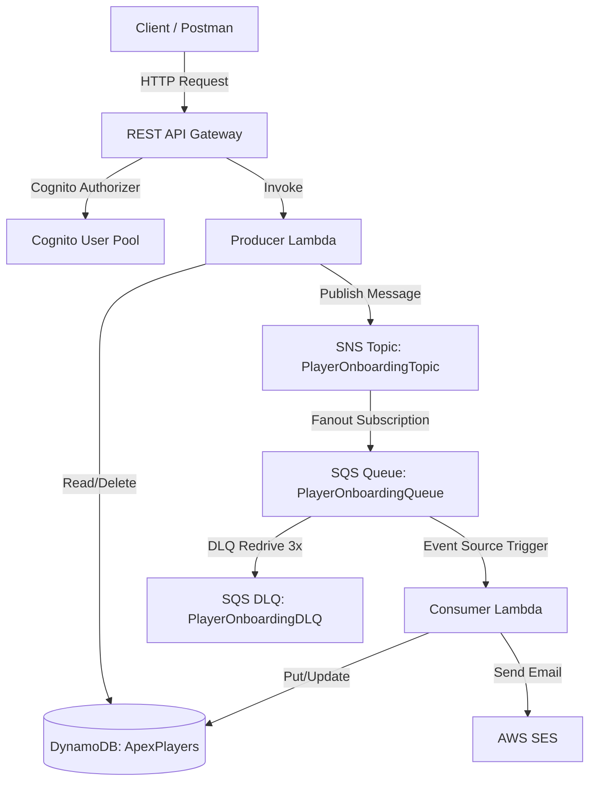

# 📖 AWS Infrastructure as Code (IaC) - Comprehensive Guide

This repository contains the complete Infrastructure as Code (IaC) definition for an asynchronous, event-driven serverless backend using **AWS Amplify Gen 2** and **AWS CDK v2**.

---

## 🚀 0. Project Initialization (Amplify Gen 2)

To initialize an Amplify Gen 2 backend in an existing repository from scratch:

1. **Run the Amplify Gen 2 creation command:**
   ```bash
   npm create amplify@latest -- -y
   ```
2. **Generated Scaffold Files:**
   * `amplify/backend.ts`: Main entry point orchestrating all CloudFormation stacks.
   * `amplify/auth/resource.ts`: Default Cognito authentication definition.
   * `amplify/package.json`: Manages `@aws-amplify/backend`, `@aws-amplify/backend-cli`, `aws-cdk-lib`, and `constructs`.
   * `amplify/tsconfig.json`: TypeScript compiler configuration for backend infrastructure.

---

## 🏛️ 1. Architecture Overview

The backend architecture implements a **Serverless Event-Driven & Decoupled Architecture** consisting of 6 core service modules:



---

## 📚 2. Core Technical Terminology

1. **Infrastructure as Code (IaC):**
   Managing and provisioning cloud infrastructure through machine-readable definition files (TypeScript) rather than manual interactive configurations on the AWS Console.

2. **IAM Execution Role:**
   An IAM identity with specific permissions that AWS services (such as Lambda) assume to execute operations securely.

3. **Least-Privilege Policy:**
   A security best practice of granting only the minimum levels of access (actions and resources) necessary for a component to perform its task.

4. **Dead Letter Queue (DLQ):**
   A specialized SQS queue targeting messages that fail processing after a specified maximum number of retries (e.g., 3 attempts).

5. **SNS Fanout Pattern:**
   A messaging pattern where a message published to an SNS topic is replicated and pushed to multiple endpoints (e.g., SQS queues) simultaneously.

6. **Event Source Mapping:**
   An AWS Lambda mapping that reads from an event source (e.g., SQS queue) and invokes a Lambda function automatically without requiring manual polling loops.

---

## 💻 3. Complete Infrastructure Source Code Reference

### 3.1. Auth Service (`amplify/auth/resource.ts`)
```typescript
import { defineAuth } from '@aws-amplify/backend';

export const auth = defineAuth({
  loginWith: {
    email: true,
  },
});
```

---

### 3.2. Storage Service (`amplify/services/storage.ts`)
```typescript
import * as cdk from 'aws-cdk-lib';
import * as dynamodb from 'aws-cdk-lib/aws-dynamodb';

export function createStorageResources(stack: cdk.Stack, env: string) {
  const apexPlayersTable = new dynamodb.Table(stack, 'ApexPlayersTable', {
    tableName: `ApexPlayers-${env}`,
    partitionKey: { name: 'teamId', type: dynamodb.AttributeType.STRING },
    sortKey: { name: 'playerId', type: dynamodb.AttributeType.STRING },
    billingMode: dynamodb.BillingMode.PAY_PER_REQUEST,
    timeToLiveAttribute: 'ttl',
    removalPolicy: cdk.RemovalPolicy.DESTROY,
  });

  return { apexPlayersTable };
}
```

---

### 3.3. Messaging Service (`amplify/services/messaging.ts`)
```typescript
import * as cdk from 'aws-cdk-lib';
import * as sqs from 'aws-cdk-lib/aws-sqs';
import * as sns from 'aws-cdk-lib/aws-sns';
import * as snsSubs from 'aws-cdk-lib/aws-sns-subscriptions';

export function createMessagingResources(stack: cdk.Stack, env: string) {
  const playerOnboardingDLQ = new sqs.Queue(stack, 'PlayerOnboardingDLQ', {
    queueName: `PlayerOnboardingDLQ-${env}`,
    retentionPeriod: cdk.Duration.days(14),
  });

  const playerOnboardingQueue = new sqs.Queue(stack, 'PlayerOnboardingQueue', {
    queueName: `PlayerOnboardingQueue-${env}`,
    visibilityTimeout: cdk.Duration.seconds(300),
    deadLetterQueue: {
      queue: playerOnboardingDLQ,
      maxReceiveCount: 3,
    },
  });

  const playerOnboardingTopic = new sns.Topic(stack, 'PlayerOnboardingTopic', {
    topicName: `PlayerOnboardingTopic-${env}`,
  });

  playerOnboardingTopic.addSubscription(
    new snsSubs.SqsSubscription(playerOnboardingQueue, {
      rawMessageDelivery: true,
    })
  );

  return { playerOnboardingDLQ, playerOnboardingQueue, playerOnboardingTopic };
}
```

---

### 3.4. Security IAM Service (`amplify/services/iam.ts`)
```typescript
import * as cdk from 'aws-cdk-lib';
import * as iam from 'aws-cdk-lib/aws-iam';

export function createIamResources(
  stack: cdk.Stack,
  env: string,
  tableArn: string,
  queueArn: string,
  topicArn: string
) {
  // 1. Producer Execution Role
  const producerLambdaRole = new iam.Role(stack, 'ProducerLambdaExecutionRole', {
    roleName: `ProducerLambdaRole-${env}`,
    assumedBy: new iam.ServicePrincipal('lambda.amazonaws.com'),
    managedPolicies: [
      iam.ManagedPolicy.fromAwsManagedPolicyName('service-role/AWSLambdaBasicExecutionRole'),
    ],
  });

  producerLambdaRole.addToPolicy(
    new iam.PolicyStatement({
      actions: ['dynamodb:GetItem', 'dynamodb:Query', 'dynamodb:DeleteItem', 'dynamodb:Scan'],
      resources: [tableArn, `${tableArn}/index/*`],
    })
  );

  producerLambdaRole.addToPolicy(
    new iam.PolicyStatement({
      actions: ['sqs:SendMessage', 'sqs:GetQueueAttributes', 'sqs:GetQueueUrl'],
      resources: [queueArn],
    })
  );

  producerLambdaRole.addToPolicy(
    new iam.PolicyStatement({
      actions: ['sns:Publish'],
      resources: [topicArn],
    })
  );

  // 2. Consumer Execution Role
  const consumerLambdaRole = new iam.Role(stack, 'ConsumerLambdaExecutionRole', {
    roleName: `ConsumerLambdaRole-${env}`,
    assumedBy: new iam.ServicePrincipal('lambda.amazonaws.com'),
    managedPolicies: [
      iam.ManagedPolicy.fromAwsManagedPolicyName('service-role/AWSLambdaBasicExecutionRole'),
    ],
  });

  consumerLambdaRole.addToPolicy(
    new iam.PolicyStatement({
      actions: ['dynamodb:GetItem', 'dynamodb:PutItem', 'dynamodb:UpdateItem', 'dynamodb:Query'],
      resources: [tableArn],
    })
  );

  consumerLambdaRole.addToPolicy(
    new iam.PolicyStatement({
      actions: ['sqs:ReceiveMessage', 'sqs:DeleteMessage', 'sqs:GetQueueAttributes'],
      resources: [queueArn],
    })
  );

  consumerLambdaRole.addToPolicy(
    new iam.PolicyStatement({
      actions: ['ses:SendEmail', 'ses:SendRawEmail'],
      resources: ['*'],
    })
  );

  return { producerLambdaRole, consumerLambdaRole };
}
```

---

### 3.5. Functions Service (`amplify/services/functions.ts`)
```typescript
import * as cdk from 'aws-cdk-lib';
import * as lambda from 'aws-cdk-lib/aws-lambda';
import * as iam from 'aws-cdk-lib/aws-iam';
import * as dynamodb from 'aws-cdk-lib/aws-dynamodb';
import * as sqs from 'aws-cdk-lib/aws-sqs';
import * as sns from 'aws-cdk-lib/aws-sns';
import * as lambdaEventSources from 'aws-cdk-lib/aws-lambda-event-sources';
import path from 'node:path';

export function createFunctionResources(
  stack: cdk.Stack,
  env: string,
  producerRole: iam.IRole,
  consumerRole: iam.IRole,
  table: dynamodb.ITable,
  queue: sqs.IQueue,
  topic: sns.ITopic
) {
  const distDir = path.resolve(process.cwd(), 'dist');

  const producerFunction = new lambda.Function(stack, 'ProducerFunction', {
    functionName: `ProducerFunction-${env}`,
    runtime: lambda.Runtime.NODEJS_20_X,
    handler: 'index.handler',
    code: lambda.Code.fromAsset(path.join(distDir, 'producer.zip')),
    role: producerRole,
    timeout: cdk.Duration.seconds(30),
    environment: {
      TABLE_NAME: table.tableName,
      QUEUE_URL: queue.queueUrl,
      TOPIC_ARN: topic.topicArn,
    },
  });

  const consumerFunction = new lambda.Function(stack, 'ConsumerFunction', {
    functionName: `ConsumerFunction-${env}`,
    runtime: lambda.Runtime.NODEJS_20_X,
    handler: 'index.handler',
    code: lambda.Code.fromAsset(path.join(distDir, 'consumer.zip')),
    role: consumerRole,
    timeout: cdk.Duration.seconds(60),
    environment: {
      TABLE_NAME: table.tableName,
    },
  });

  consumerFunction.addEventSource(
    new lambdaEventSources.SqsEventSource(queue, {
      batchSize: 10,
    })
  );

  return { producerFunction, consumerFunction };
}
```

---

### 3.6. API Gateway Service (`amplify/services/api.ts`)
```typescript
import * as cdk from 'aws-cdk-lib';
import * as apigateway from 'aws-cdk-lib/aws-apigateway';
import * as lambda from 'aws-cdk-lib/aws-lambda';

export function createApiResources(
  stack: cdk.Stack,
  env: string,
  userPoolArn: string,
  producerLambda: lambda.IFunction
) {
  const restApi = new apigateway.RestApi(stack, 'ApexRestApi', {
    restApiName: `ApexRestApi-${env}`,
    deployOptions: { stageName: env },
    defaultCorsPreflightOptions: {
      allowOrigins: apigateway.Cors.ALL_ORIGINS,
      allowMethods: apigateway.Cors.ALL_METHODS,
    },
  });

  const cognitoAuthorizer = new apigateway.CfnAuthorizer(stack, 'CognitoAuthorizer', {
    name: `CognitoAuthorizer-${env}`,
    restApiId: restApi.restApiId,
    type: 'COGNITO_USER_POOLS',
    providerArns: [userPoolArn],
    identitySource: 'method.request.header.Authorization',
  });

  const playersResource = restApi.root.addResource('players');
  const producerIntegration = new apigateway.LambdaIntegration(producerLambda);

  playersResource.addMethod('POST', producerIntegration, {
    authorizer: { authorizerId: cognitoAuthorizer.ref },
    authorizationType: apigateway.AuthorizationType.COGNITO,
  });

  playersResource.addMethod('GET', producerIntegration, {
    authorizer: { authorizerId: cognitoAuthorizer.ref },
    authorizationType: apigateway.AuthorizationType.COGNITO,
  });

  return { restApi };
}
```

---

### 3.7. SSM Service (`amplify/services/ssm.ts`)
```typescript
import * as cdk from 'aws-cdk-lib';
import * as ssm from 'aws-cdk-lib/aws-ssm';

export function createSsmParameters(
  stack: cdk.Stack,
  env: string,
  region: string,
  userPoolId: string,
  userPoolClientId: string,
  restApiId: string
) {
  new ssm.StringParameter(stack, 'SsmUserPoolId', {
    parameterName: `/apex/${env}/USER_POOL_ID`,
    stringValue: userPoolId,
  });

  new ssm.StringParameter(stack, 'SsmUserPoolClientId', {
    parameterName: `/apex/${env}/USER_POOL_CLIENT_ID`,
    stringValue: userPoolClientId,
  });

  new ssm.StringParameter(stack, 'SsmApiEndpoint', {
    parameterName: `/apex/${env}/API_ENDPOINT`,
    stringValue: `https://${restApiId}.execute-api.${region}.amazonaws.com/${env}/`,
  });
}
```

---

### 3.8. Main Backend Orchestrator (`amplify/backend.ts`)
```typescript
import { defineBackend } from '@aws-amplify/backend';
import { auth } from './auth/resource';
import * as cdk from 'aws-cdk-lib';
import { createStorageResources } from './services/storage';
import { createMessagingResources } from './services/messaging';
import { createIamResources } from './services/iam';
import { createFunctionResources } from './services/functions';
import { createApiResources } from './services/api';
import { createSsmParameters } from './services/ssm';

export const backend = defineBackend({
  auth,
});

const customStack = backend.createStack('CustomInfrastructureStack');

const explicitEnv = customStack.node.tryGetContext('env');
const isSandbox = cdk.Stack.of(customStack).stackName.includes('sandbox');
const env = isSandbox ? 'sandbox' : (explicitEnv || 'dev');
const region = cdk.Stack.of(customStack).region;

// 1. Storage
const { apexPlayersTable } = createStorageResources(customStack, env);

// 2. Messaging
const { playerOnboardingQueue, playerOnboardingTopic } = createMessagingResources(customStack, env);

// 3. Security (IAM)
const { producerLambdaRole, consumerLambdaRole } = createIamResources(
  customStack,
  env,
  apexPlayersTable.tableArn,
  playerOnboardingQueue.queueArn,
  playerOnboardingTopic.topicArn
);

// 4. Functions & Triggers
const { producerFunction } = createFunctionResources(
  customStack,
  env,
  producerLambdaRole,
  consumerLambdaRole,
  apexPlayersTable,
  playerOnboardingQueue,
  playerOnboardingTopic
);

// 5. API Gateway
const { restApi } = createApiResources(
  customStack,
  env,
  backend.auth.resources.userPool.userPoolArn,
  producerFunction
);

// 6. SSM Environment Parameters
createSsmParameters(
  customStack,
  env,
  region,
  backend.auth.resources.userPool.userPoolId,
  backend.auth.resources.userPoolClient.userPoolClientId,
  restApi.restApiId
);
```

---

## 🛠️ 4. Deployment Instructions via CLI

1. **Build Lambda Function Packages:**
   ```bash
   npm run build
   ```
2. **Deploy Complete Infrastructure to Cloud:**
   ```bash
   npx -y @aws-amplify/backend-cli sandbox
   ```
