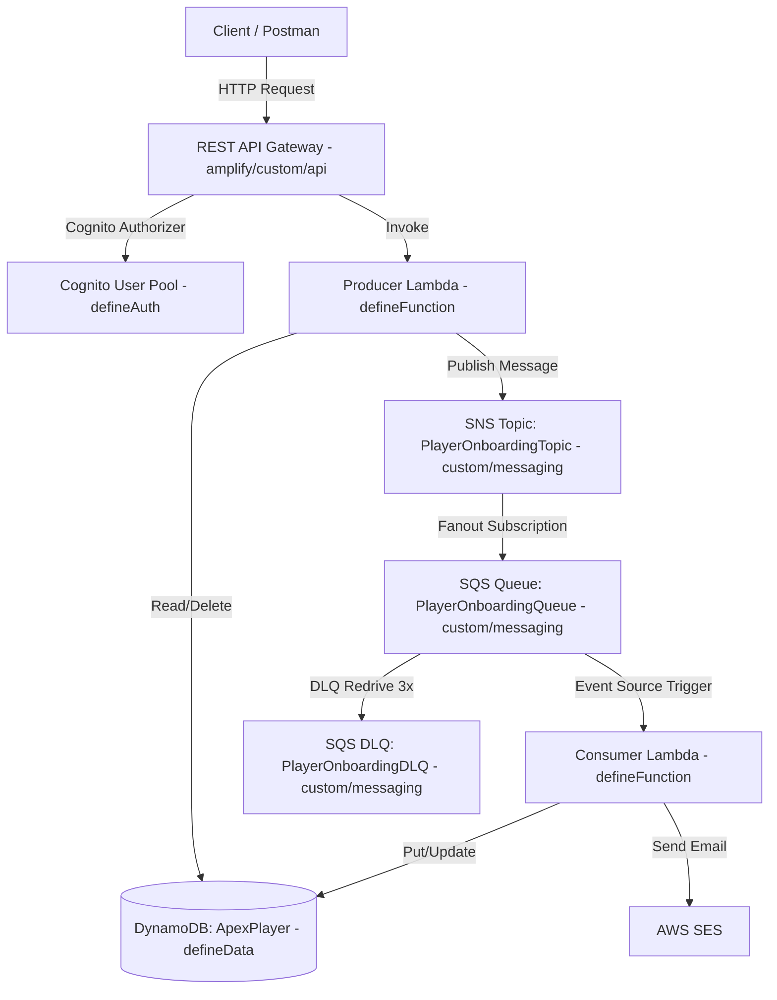

# 📖 Hướng Dẫn Học & Backup Hạ Tầng AWS dạng Code (IaC) - Bản Tiếng Việt

> **Mục đích:** File tài liệu tiếng Việt này lưu trữ tại local giúp bạn học tập, hiểu sâu bản chất kiến trúc và tra cứu nhanh toàn bộ mã nguồn hạ tầng AWS (Amplify Gen 2 & AWS CDK v2).

---

## 🚀 0. Hướng Dẫn Khởi Tạo Dự Án Amplify Gen 2 Từ Đầu (Init Amplify Gen 2)

Để khởi tạo lại thư mục `amplify/` từ con số 0 trong một repository có sẵn:

1. **Chạy lệnh khởi tạo Amplify Gen 2:**
   ```bash
   npm create amplify@latest -- -y
   ```
2. **Cấu Trúc Thư Mục Chuẩn (Không sử dụng S3 Storage):**
   ```text
   amplify/
   ├── auth/
   │   └── resource.ts                   # Định nghĩa xác thực Cognito bằng defineAuth
   ├── data/
   │   └── resource.ts                   # Định nghĩa Data API / Database Schema bằng defineData & a.schema
   ├── functions/
   │   ├── producer-function/
   │   │   ├── resource.ts               # Định nghĩa hàm Producer Lambda bằng defineFunction & secret
   │   │   └── handler.ts                # Mã nguồn xử lý của Lambda
   │   └── consumer-function/
   │       ├── resource.ts               # Định nghĩa hàm Consumer Lambda bằng defineFunction
   │       └── handler.ts                # Mã nguồn xử lý của Lambda
   ├── custom/                           # Các tài nguyên AWS mở rộng bằng AWS CDK v2 (SQS, SNS, REST API, IAM, SSM)
   │   ├── messaging/resource.ts         # Khai báo SQS Queue, SQS DLQ, SNS Topic bằng CDK
   │   ├── iam/resource.ts               # Custom IAM Roles & Policy Statements
   │   ├── api/resource.ts               # REST API Gateway tùy chỉnh
   │   └── ssm/resource.ts               # SSM Parameter Store
   ├── utils/                            # Thư mục chứa các hàm utility tái sử dụng
   │   ├── env.ts                        # Helper lấy biến môi trường ENV (develop/staging/prod)
   │   └── path.ts                       # Helper getLambdaEntry giải quyết đường dẫn tuyệt đối cho Lambda handlers
   ├── backend.ts                        # File tổng điều phối hệ thống bằng defineBackend & backend.createStack
   ├── package.json
   └── tsconfig.json
   .env                                  # File biến môi trường local (chứa secret/mẫu config local, được .gitignore)
   .env.sample                           # File mẫu biến môi trường chuẩn làm template cho dự án
   ```

---

## 🏛️ 1. Tổng Quan Kiến Trúc (Architecture Overview)

Hệ thống Backend được thiết kế theo mô hình **Serverless Event-Driven & Decoupled Architecture** kết hợp giữa các primitives nguyên bản của Amplify Gen 2 (`defineAuth`, `defineData`, `defineFunction`) và tài nguyên tùy chỉnh AWS CDK v2:



---

## 📚 2. Giải Thích Thuật Ngữ, Các Hàm Core & Cách Định Nghĩa Dịch Vụ Trong Amplify Gen 2

### 2.1. Các Hàm Core (Primitives) Của Amplify Gen 2
1. **`defineAuth`**: Hàm khởi tạo Cognito User Pool & Identity Pool của Amplify Gen 2, hỗ trợ cấu hình thuộc tính người dùng, xác thực đăng nhập người dùng, và các Lambda triggers.
2. **`defineData` & `a.schema`**: Hàm khởi tạo Data API (GraphQL/AppSync) tạo bảng DynamoDB tự động qua `a.model`, các truy vấn tùy chỉnh (`a.query`), mutation (`a.mutation`), và liên kết trực tiếp với Lambda qua `a.handler.function`.
3. **`defineFunction` & `secret`**: Hàm khai báo Lambda function, biến môi trường, thời gian timeout, và quản lý các secret bảo mật (API keys, credentials) thông qua Amplify CLI.
4. **`defineBackend`**: Điểm khởi tạo trung tâm trong `amplify/backend.ts` tổng hợp tất cả tài nguyên và cung cấp `backend.createStack` để tích hợp bất kỳ dịch vụ AWS CDK nào.

> ⚠️ **Lưu ý quan trọng về Storage (S3)**: Trong thiết kế hệ thống này, dự án không sử dụng S3 nên **không sử dụng `defineStorage`**. Thư mục `amplify/storage/` hoàn toàn được loại bỏ.

---

### 2.2. Các Service Liên Quan Tới SQS, SNS, SES Được Config Như Thế Nào? Có `defineSQS` Không?

> ❓ **Câu hỏi:** *Các service liên quan tới SQS, SNS, SES có function nào để define không? Hay là config như thế nào?*

**Trả lời:**
- **KHÔNG CÓ** các hàm `defineSQS`, `defineSNS`, hay `defineSES` trong Amplify Gen 2.
- Amplify Gen 2 chỉ cung cấp 4 hàm primitive chính: `defineAuth`, `defineData`, `defineFunction`, và `defineStorage`.
- Đối với các dịch vụ AWS khác như **SQS, SNS, SES, EventBridge, REST API Gateway, ECS, Secrets Manager...**, Amplify Gen 2 thiết kế theo cơ chế **mở rộng bằng AWS CDK v2 (Level 2 Constructs)**.

**Cách Config SQS, SNS, SES chuẩn trong Amplify Gen 2:**
1. **SQS & SNS**: Khai báo bằng AWS CDK constructs (`aws-cdk-lib/aws_sqs`, `aws-cdk-lib/aws_sns`) trong thư mục `amplify/custom/messaging/resource.ts` hoặc tạo stack bằng `backend.createStack('CustomMessagingStack')`.
2. **Kích hoạt Consumer Lambda từ SQS**: Dùng `consumerLambda.addEventSource(new lambdaEventSources.SqsEventSource(playerOnboardingQueue, { batchSize: 10 }))` trong `amplify/backend.ts`.
3. **SES (Simple Email Service)**: SES thường không cần khởi tạo resource dạng CloudFormation stack nếu dùng email identity thông thường, nhưng Lambda Consumer cần được cấp quyền gửi email (`ses:SendEmail`, `ses:SendRawEmail`) thông qua IAM Policy Statement hoặc CDK `.grant...()`.

---

### 2.3. IAM Roles Được Định Nghĩa Bằng Method Gì Trong Amplify Gen 2?

> ❓ **Câu hỏi:** *IAM roles thì sẽ define bằng method gì? Hướng dẫn chi tiết cách define IAM roles bằng Amplify Gen 2, nếu nó đi kèm với các resource khác thì giải thích rõ.*

Trong Amplify Gen 2, IAM Roles được định nghĩa và quản lý thông qua **2 phương pháp chính**:

#### Phương pháp 1: Tự động quản lý (Implicit / Managed IAM Roles)
Các primitive của Amplify Gen 2 tự động khởi tạo IAM Role với nguyên tắc Least Privilege:
- **`defineAuth`**: Tự động tạo 2 IAM Roles trong Cognito Identity Pool: `authenticatedUserIamRole` (dành cho user đã login) và `unauthenticatedUserIamRole` (dành cho guest).
- **`defineData`**: Tự động tạo IAM Role cho AppSync Data API để truy vấn các bảng DynamoDB dựa trên các luật authorization như `allow.authenticated()`, `allow.guest()`, `allow.owner()`.
- **`defineFunction`**: Tự động tạo một IAM Execution Role cho từng hàm Lambda với managed policy `AWSLambdaBasicExecutionRole` (cho phép ghi log vào CloudWatch Logs).

#### Phương pháp 2: Định nghĩa & Mở rộng IAM Roles qua AWS CDK trong `amplify/backend.ts` (Explicit / Custom IAM Roles)
Khi các hàm Lambda hoặc User Roles cần tương tác với SQS, SNS, SES, hoặc DynamoDB custom, bạn có thể thực hiện theo **2 cách**:

##### Cách A (Khuyên dùng - CDK Grant Helpers & `.addToRolePolicy`):
Truy cập trực tiếp vào L2 Resource Construct của Amplify Gen 2 trong `amplify/backend.ts` và sử dụng các method helper của CDK:
```typescript
// 1. Cấp quyền cho Producer Lambda publish tin nhắn tới SNS Topic
playerOnboardingTopic.grantPublish(backend.producerFunction.resources.lambda);

// 2. Cấp quyền cho Consumer Lambda nhận/xóa tin nhắn từ SQS Queue
playerOnboardingQueue.grantConsumeMessages(backend.consumerFunction.resources.lambda);

// 3. Thêm Policy Statement gửi Email qua SES cho Consumer Lambda
backend.consumerFunction.resources.lambda.addToRolePolicy(
  new iam.PolicyStatement({
    actions: ['ses:SendEmail', 'ses:SendRawEmail'],
    resources: ['*'], // hoặc ARN cụ thể của SES Identity
  })
);
```

##### Cách B (Tạo Custom IAM Role riêng bằng `new iam.Role(...)`):
Viết module custom IAM (`amplify/custom/iam/resource.ts`) khi cần định nghĩa Role phức tạp với custom assume policy:
```typescript
import * as cdk from 'aws-cdk-lib';
import * as iam from 'aws-cdk-lib/aws-iam';

export function createProducerLambdaRole(stack: cdk.Stack, env: string, queueArn: string, topicArn: string) {
  const role = new iam.Role(stack, 'ProducerLambdaExecutionRole', {
    roleName: `ProducerLambdaRole-${env}`,
    assumedBy: new iam.ServicePrincipal('lambda.amazonaws.com'),
    managedPolicies: [
      iam.ManagedPolicy.fromAwsManagedPolicyName('service-role/AWSLambdaBasicExecutionRole'),
    ],
  });

  role.addToPolicy(
    new iam.PolicyStatement({
      actions: ['sns:Publish'],
      resources: [topicArn],
    })
  );

  return role;
}
```

#### Mối quan hệ giữa IAM Roles và các Resource khác:
| Resource nguồn | Resource đích tương tác | IAM Method / Mechanism | Mục đích phân quyền |
| :--- | :--- | :--- | :--- |
| **Cognito User Pool** | AppSync Data API | `a.allow.authenticated()` trong `resource.ts` | Cho phép user đăng nhập được truy vấn GraphQL |
| **AppSync GraphQL** | DynamoDB Table | Amplify Data Managed Role | AppSync tự động đọc/ghi dữ liệu DynamoDB |
| **Producer Lambda** | SNS Topic | `topic.grantPublish(producerLambda)` | Lambda có quyền `sns:Publish` tin nhắn event |
| **SNS Topic** | SQS Queue | `topic.addSubscription(new SqsSubscription(queue))` | SNS có quyền push tin nhắn tự động vào SQS Queue |
| **SQS Queue** | Consumer Lambda | `consumerLambda.addEventSource(new SqsEventSource(queue))` | Event Source Mapping pull tin nhắn từ SQS truyền vào Lambda |
| **Consumer Lambda** | AWS SES | `consumerLambda.addToRolePolicy(sesPolicy)` | Lambda có quyền `ses:SendEmail` gửi mail thông báo |

---

### 2.4. Phân Biệt Biến Môi Trường (.env, .env.sample) & Amplify Secrets trong Amplify Gen 2

> ❓ **Câu hỏi:** *Quản lý biến môi trường (`ENV`) và các Secrets bảo mật (`API_SECRET`) trong Amplify Gen 2 như thế nào? Phân biệt giữa `.env` và `secret()`?*

**1. Phân biệt Biến Môi Trường (.env) & Secrets (`secret()`):**
- **Biến môi trường thông thường (`.env` / `.env.sample`)**: Dùng cho các thông số cấu hình không nhạy cảm như `ENV=develop`, `AWS_REGION=us-east-1`, `TABLE_NAME`, `SQS_QUEUE_URL`, `SENDER_EMAIL`. File `.env.sample` cung cấp mẫu template, còn `.env` chứa config local và nằm trong `.gitignore`.
- **Amplify Secrets (`secret('API_SECRET')`)**: Dành riêng cho các thông tin nhạy cảm (API Keys, Token, Password). Secrets **KHÔNG** lưu trong file `.env` hay git repository mà được quản lý an toàn qua CLI lệnh:
  ```bash
  npx ampx secret set API_SECRET
  ```
  AWS Amplify sẽ mã hóa và lưu vào SSM Parameter Store, sau đó tự động tiêm vào Lambda function tại thời điểm deploy.

**2. Tách hàm Helper ra module riêng `amplify/utils/env.ts`:**
Để đảm bảo nguyên tắc Clean Code và tính tái sử dụng cao, hàm utility `getEnv` được di chuyển ra file riêng `amplify/utils/env.ts`:

```typescript
/**
 * Utility lấy biến môi trường ENV (develop, staging, prod):
 * Mặc định fallback về 'develop' nếu không có biến môi trường ENV.
 */
export const getEnv = (): string => {
  return process.env.ENV || 'develop';
};
```

---

## 💻 3. Mã Nguồn Mẫu Đầy Đủ Theo Quy Trình Setup (Step-by-Step Setup Workflow)

Dưới đây là mã nguồn chuẩn **Amplify Gen 2 & AWS CDK v2** được tổ chức theo đúng **quy trình triển khai từ đầu đến cuối (step-by-step)**. Mỗi dòng lệnh đều đi kèm **comment giải thích chi tiết ý nghĩa và lý do sử dụng**:

---

### 📌 Bước 3.1: Khởi tạo Cấu hình Xác thực Người dùng (Authentication Resource)
- **Mục đích**: Cấu hình Amazon Cognito User Pool để cho phép người dùng đăng ký, đăng nhập bằng Email và nhận JWT Token phục vụ gọi API an toàn.
- **File cần tạo/cập nhật**: `amplify/auth/resource.ts`

```typescript
// 1. Import hàm primitive defineAuth từ thư viện core của Amplify Backend
import { defineAuth } from '@aws-amplify/backend';

// 2. Khai báo và export đối tượng auth làm cấu hình xác thực duy nhất cho toàn bộ ứng dụng
export const auth = defineAuth({
  // 3. Cấu hình phương thức đăng nhập chính: cho phép user dùng địa chỉ Email để sign-in
  loginWith: {
    email: true, // Bật đăng nhập bằng email (không bắt buộc dùng username mặc định của Cognito)
  },
  // 4. Định nghĩa các thuộc tính bổ sung người dùng phải cung cấp khi đăng ký tài khoản
  userAttributes: {
    preferredUsername: {
      required: true, // Bắt buộc người dùng phải điền Tên hiển thị (preferredUsername) khi đăng ký
      mutable: true,  // Cho phép người dùng có thể cập nhật Tên hiển thị sau này
    },
  },
});
```

---

### 📌 Bước 3.2: Khai báo Các Hàm Serverless Lambda Functions & Build Flow
- **Mục đích**: Khai báo và trỏ trực tiếp `entry` tới mã nguồn xử lý trong thư mục `src/lambdas/`. Đóng gói mã nguồn bằng script build tự động `scripts/build-lambdas.ts` thành file ZIP độc lập trong `dist/`.
- **Files cần tạo/cập nhật**:
  1. Producer Lambda Resource: `amplify/functions/producer-function/resource.ts` (Trỏ `entry` tới `src/lambdas/producer/handler.ts`)
  2. Producer Handler & Controller: `src/lambdas/producer/handler.ts` & `controller.ts`
  3. Consumer Lambda Resource: `amplify/functions/consumer-function/resource.ts` (Trỏ `entry` tới `src/lambdas/consumer/handler.ts`)
  4. Consumer Handler & Processor: `src/lambdas/consumer/handler.ts` & `processor.ts`
  5. Script đóng gói tự động: `scripts/build-lambdas.ts` (Đóng gói mã nguồn thành `dist/producer.zip` & `dist/consumer.zip`)

#### 1. Producer Function Resource (`amplify/functions/producer-function/resource.ts`)
```typescript
// 1. Import hàm defineFunction và helper secret từ Amplify Backend core
import { defineFunction, secret } from '@aws-amplify/backend';
// 2. Import helper utilities getEnv và getLambdaEntry từ module utils
import { getEnv } from '../../utils/env';
import { getLambdaEntry } from '../../utils/path';

// 3. Định nghĩa và export cấu hình cho Producer Lambda Function
export const producerFunction = defineFunction({
  name: 'producer-function',    // Tên của Lambda Function hiển thị trên AWS CloudFormation/Console
  entry: getLambdaEntry('producer'), // Best Practice: dùng helper giải quyết đường dẫn tới handler trong src/lambdas/
  timeoutSeconds: 30,           // Thời gian tối đa (Timeout) cho 1 lần thực thi là 30 giây
  environment: {                // Khai báo các biến môi trường được truyền vào Lambda khi khởi chạy
    ENV: getEnv(),              // Biến môi trường ENV duy nhất (mặc định: develop)
    API_SECRET: secret('API_SECRET'), // Lấy giá trị Secret an toàn từ SSM Parameter Store / Amplify Secrets
  },
});
```

#### 2. Producer Function Handler (`src/lambdas/producer/handler.ts`)
```typescript
// 1. Import kiểu dữ liệu và Controller xử lý logic chính
import { ApiGatewayProxyEvent, ApiResponse } from '@shared/types';
import { ProducerController } from './controller';

const controller = new ProducerController();

// 2. Định nghĩa hàm handler chính tiếp nhận request và chuyển giao cho Controller
export async function handler(event: ApiGatewayProxyEvent): Promise<ApiResponse> {
  return controller.handle(event);
}
```

#### 3. Consumer Function Resource (`amplify/functions/consumer-function/resource.ts`)
```typescript
// 1. Import hàm primitive defineFunction từ Amplify Gen 2 core và helper getLambdaEntry
import { defineFunction } from '@aws-amplify/backend';
import { getLambdaEntry } from '../../utils/path';

// 2. Khai báo và export cấu hình Consumer Lambda Function
export const consumerFunction = defineFunction({
  name: 'consumer-function',  // Tên nhận diện duy nhất của Consumer Lambda
  entry: getLambdaEntry('consumer'), // Best Practice: dùng helper giải quyết đường dẫn tới handler trong src/lambdas/
  timeoutSeconds: 60,         // Cho phép thời gian xử lý tối đa 60 giây (do xử lý batch tin nhắn SQS)
});
```

#### 4. Consumer Function Handler (`src/lambdas/consumer/handler.ts`)
```typescript
// 1. Import Processor xử lý tin nhắn SQS
import { ConsumerProcessor, SqsRecordInput } from './processor';

const processor = new ConsumerProcessor();

// 2. Định nghĩa hàm handler async xử lý batch tin nhắn SQS và trả về batchItemFailures
export async function handler(event: { Records?: SqsRecordInput[] }) {
  const records = event.Records || [];
  const batchItemFailures = [];

  for (const record of records) {
    try {
      await processor.processRecord(record);
    } catch (err) {
      batchItemFailures.push({ itemIdentifier: record.messageId });
    }
  }

  return { batchItemFailures };
}
```

#### 5. Quy Trình Build & Đóng Gói Bundle ZIP (`scripts/build-lambdas.ts`)
Lệnh `npm run build` thực thi file script `scripts/build-lambdas.ts` để sử dụng `esbuild` biên dịch TypeScript thành ESM JavaScript (Target Node 20) và đóng gói lại thành các file ZIP độc lập:
- Biên dịch `src/lambdas/producer/handler.ts` $\rightarrow$ `dist/producer/index.js` $\rightarrow$ Nén thành `dist/producer.zip`
- Biên dịch `src/lambdas/consumer/handler.ts` $\rightarrow$ `dist/consumer/index.js` $\rightarrow$ Nén thành `dist/consumer.zip`

---

### 📌 Bước 3.3: Khai báo Data API (GraphQL AppSync) & DynamoDB Database Schema
- **Mục đích**: Định nghĩa cấu trúc cơ sở dữ liệu DynamoDB và liên kết GraphQL custom mutation trực tiếp với Producer Lambda function đã tạo ở Bước 3.2.
- **File cần tạo/cập nhật**: `amplify/data/resource.ts`

```typescript
// 1. Import các utility: ClientSchema để xuất kiểu dữ liệu, 'a' builder cho schema, defineData để tạo Data API
import { type ClientSchema, a, defineData } from '@aws-amplify/backend';
// 2. Import tham chiếu Producer Lambda từ Bước 3.2 để làm handler cho custom mutation
import { producerFunction } from '../functions/producer-function/resource';

// 3. Xây dựng Data Schema chính cho ứng dụng sử dụng builder 'a.schema'
const schema = a.schema({
  // 4. Khai báo DynamoDB Model tên là 'ApexPlayer'
  ApexPlayer: a
    .model({
      teamId: a.string().required(),   // Trường teamId kiểu String, bắt buộc có giá trị (Required)
      playerId: a.string().required(), // Trường playerId kiểu String, bắt buộc có giá trị (Required)
      name: a.string(),                // Trường name kiểu String (Tùy chọn/Optional)
      email: a.string(),               // Trường email kiểu String (Tùy chọn/Optional)
      status: a.enum(['ACTIVE', 'INJURED', 'INACTIVE']), // Trường status theo danh sách Enum cố định
    })
    .identifier(['teamId', 'playerId']) // Thiết lập Composite Primary Key: Hash Key = teamId, Range Key = playerId
    .authorization((allow) => [allow.authenticated()]), // Phân quyền: Cho phép tất cả User đã đăng nhập Cognito truy cập CRUD

  // 5. Khai báo Custom GraphQL Mutation tên là 'onboardPlayer'
  // (Cho phép Client kích hoạt logic phức tạp thông qua AppSync -> Lambda thay vì ghi thẳng vào DynamoDB)
  onboardPlayer: a
    .mutation()                        // Xác định đây là một GraphQL Mutation operation
    .arguments({                       // Khai báo các tham số mà Client phải truyền vào khi gọi mutation
      teamId: a.string().required(),   // Tham số teamId kiểu String (Bắt buộc)
      playerId: a.string().required(), // Tham số playerId kiểu String (Bắt buộc)
    })
    .returns(a.json())                 // Quy định kiểu dữ liệu trả về là JSON linh hoạt từ kết quả của Lambda
    .authorization((allow) => [allow.authenticated()]) // Giới hạn quyền: Chỉ User đã đăng nhập mới được gọi
    .handler(a.handler.function(producerFunction)),   // Định tuyến trực tiếp mutation request sang cho Producer Lambda xử lý
});

// 6. Xuất kiểu Schema để Frontend TypeScript client có thể import và sử dụng type-safe
export type Schema = ClientSchema<typeof schema>;

// 7. Khai báo và export Data Resource sử dụng hàm defineData của Amplify Gen 2
export const data = defineData({
  schema, // Truyền schema vừa định nghĩa ở trên vào
  authorizationModes: {
    defaultAuthorizationMode: 'userPool', // Chọn Cognito User Pools làm cơ chế xác thực mặc định cho Data API
  },
});
```

---

### 📌 Bước 3.4: Khai báo Hạ tầng Tùy chỉnh (Custom Infrastructure) với AWS CDK v2
- **Mục đích**: Khai báo các tài nguyên hạ tầng mà Amplify Gen 2 không hỗ trợ `define*` primitive (như SQS Queue, DLQ, SNS Topic, REST API Gateway).
- **Files cần tạo/cập nhật**:
  1. `amplify/custom/messaging/resource.ts` (SQS & SNS Event Messaging Stack)
  2. `amplify/custom/api/resource.ts` (Custom REST API Gateway Stack)

#### 1. Custom Messaging Stack (`amplify/custom/messaging/resource.ts`)
```typescript
// 1. Import các module chuẩn từ AWS CDK v2 cho SQS, SNS và Subscriptions
import * as cdk from 'aws-cdk-lib';
import * as sqs from 'aws-cdk-lib/aws-sqs';
import * as sns from 'aws-cdk-lib/aws-sns';
import * as snsSubs from 'aws-cdk-lib/aws-sns-subscriptions';

// 2. Khai báo hàm helper nhận vào CDK Stack và tên môi trường để khởi tạo Messaging Resources
export function createMessagingResources(stack: cdk.Stack, env: string) {
  // 3. Khởi tạo SQS Dead Letter Queue (DLQ) để chứa các message bị lỗi quá 3 lần
  const playerOnboardingDLQ = new sqs.Queue(stack, 'PlayerOnboardingDLQ', {
    queueName: `PlayerOnboardingDLQ-${env}`,   // Tên Queue được đặt động theo môi trường (vd: dev)
    retentionPeriod: cdk.Duration.days(14),      // Thời gian lưu trữ tin nhắn hỏng tối đa trong DLQ là 14 ngày
  });

  // 4. Khởi tạo SQS Main Queue chính nhận tin nhắn xử lý từ ứng dụng
  const playerOnboardingQueue = new sqs.Queue(stack, 'PlayerOnboardingQueue', {
    queueName: `PlayerOnboardingQueue-${env}`, // Tên Queue chính theo môi trường
    visibilityTimeout: cdk.Duration.seconds(300), // Thời gian khóa tin nhắn khi Lambda đang xử lý là 5 phút
    deadLetterQueue: {                         // Cấu hình DLQ tự động chuyển tin nhắn khi thất bại
      queue: playerOnboardingDLQ,             // Trỏ vào Dead Letter Queue vừa tạo ở trên
      maxReceiveCount: 3,                      // Thử lại tối đa 3 lần trước khi đẩy vào DLQ
    },
  });

  // 5. Khởi tạo SNS Topic để đóng vai trò làm Publisher (Event Router)
  const playerOnboardingTopic = new sns.Topic(stack, 'PlayerOnboardingTopic', {
    topicName: `PlayerOnboardingTopic-${env}`, // Tên SNS Topic theo môi trường
  });

  // 6. Đăng ký (Subscribe) SQS Queue vào SNS Topic theo mô hình Fanout Architecture
  playerOnboardingTopic.addSubscription(
    new snsSubs.SqsSubscription(playerOnboardingQueue, {
      rawMessageDelivery: true, // Bật giao trực tiếp nguyên bản nội dung message (không bọc thêm SNS wrapper header)
    })
  );

  // 7. Trả về đối tượng chứa các CDK Construct để đính kèm vào backend orchestrator ở Bước 3.5
  return { playerOnboardingDLQ, playerOnboardingQueue, playerOnboardingTopic };
}
```

#### 2. Custom REST API Gateway Stack (`amplify/custom/api/resource.ts`)
```typescript
// 1. Import các module CDK tương ứng cho API Gateway và Lambda
import * as cdk from 'aws-cdk-lib';
import * as apigateway from 'aws-cdk-lib/aws-apigateway';
import * as lambda from 'aws-cdk-lib/aws-lambda';

// 2. Khai báo hàm helper để định nghĩa Custom REST API Gateway
export function createApiResources(
  stack: cdk.Stack,               // CDK Stack cha
  env: string,                    // Tên môi trường (dev/sandbox)
  userPoolArn: string,            // ARN của Cognito User Pool để phân quyền API
  producerLambda: lambda.IFunction // Tham chiếu Lambda function xử lý request
) {
  // 3. Khởi tạo REST API Gateway instance
  const restApi = new apigateway.RestApi(stack, 'ApexRestApi', {
    restApiName: `ApexRestApi-${env}`, // Tên API trên AWS Console
    deployOptions: { stageName: env }, // Đặt tên Stage deployment (dev/sandbox)
    defaultCorsPreflightOptions: {     // Cấu hình CORS mở cho tất cả tên miền truy cập
      allowOrigins: apigateway.Cors.ALL_ORIGINS,
      allowMethods: apigateway.Cors.ALL_METHODS,
    },
  });

  // 4. Tạo Cognito Authorizer cho REST API dựa trên User Pool từ Bước 3.1
  const cognitoAuthorizer = new apigateway.CfnAuthorizer(stack, 'CognitoAuthorizer', {
    name: `CognitoAuthorizer-${env}`,                         // Tên Authorizer
    restApiId: restApi.restApiId,                             // Trỏ vào ID của REST API vừa tạo
    type: 'COGNITO_USER_POOLS',                               // Loại xác thực qua Cognito User Pool
    providerArns: [userPoolArn],                              // Đăng ký ARN của Cognito User Pool từ Bước 3.1
    identitySource: 'method.request.header.Authorization',    // Đọc token từ HTTP Header Authorization
  });

  // 5. Tạo Endpoint URL resource '/players'
  const playersResource = restApi.root.addResource('players');
  // 6. Tích hợp HTTP Request tới Producer Lambda Function từ Bước 3.2
  const producerIntegration = new apigateway.LambdaIntegration(producerLambda);

  // 7. Thêm phương thức HTTP POST vào '/players', yêu cầu phải có Token hợp lệ từ Cognito
  playersResource.addMethod('POST', producerIntegration, {
    authorizer: { authorizerId: cognitoAuthorizer.ref },     // Gán Cognito Authorizer
    authorizationType: apigateway.AuthorizationType.COGNITO, // Loại Authorization là Cognito
  });

  // 8. Trả về đối tượng REST API
  return { restApi };
}
```

---

### 📌 Bước 3.5: Tích hợp Toàn bộ Hạ tầng, Cấp quyền IAM & Kích hoạt Triggers (Main Orchestrator)
- **Mục đích**: Gom tất cả Amplify Primitives (Auth, Data, Functions), tạo Custom Stack cho CDK resources (SQS, SNS, API Gateway), liên kết SQS trigger cho Consumer Lambda và cấp quyền IAM Role chi tiết (`grantPublish`, `grantConsumeMessages`, `addToRolePolicy` cho SES).
- **File cần tạo/cập nhật**: `amplify/backend.ts`

```typescript
// 1. Import hàm trung tâm defineBackend từ Amplify Gen 2 core
import { defineBackend } from '@aws-amplify/backend';
// 2. Import các cấu hình resource đã định nghĩa ở Bước 3.1, 3.2, 3.3
import { auth } from './auth/resource';
import { data } from './data/resource';
import { producerFunction } from './functions/producer-function/resource';
import { consumerFunction } from './functions/consumer-function/resource';
// 3. Import các module CDK Custom Resources từ Bước 3.4
import { createMessagingResources } from './custom/messaging/resource';
import { createApiResources } from './custom/api/resource';
// 4. Import CDK Event Sources và IAM module để liên kết SQS trigger và cấp quyền IAM
import * as lambdaEventSources from 'aws-cdk-lib/aws-lambda-event-sources';
import * as iam from 'aws-cdk-lib/aws-iam';

// 5. Khởi tạo đối tượng backend chính bằng defineBackend, gom tất cả Amplify primitives
export const backend = defineBackend({
  auth,               // Đưa cấu hình Auth (Bước 3.1) vào hệ thống
  data,               // Đưa cấu hình Data API (Bước 3.3) vào hệ thống
  producerFunction,   // Đưa Producer Lambda (Bước 3.2) vào hệ thống
  consumerFunction,   // Đưa Consumer Lambda (Bước 3.2) vào hệ thống
});

// 6. Tạo một Custom CloudFormation Stack mới thuộc Backend này để chứa tài nguyên CDK tùy chỉnh
const customStack = backend.createStack('CustomInfrastructureStack');
const env = 'dev'; // Khai báo biến môi trường đại diện

// 7. Thực thi hàm tạo SQS Queues, DLQ và SNS Topic trên Custom Stack (Bước 3.4)
const { playerOnboardingQueue, playerOnboardingTopic } = createMessagingResources(customStack, env);

// 8. Trích xuất tham chiếu L2 Construct của các Lambda Functions từ Amplify Backend instance
const producerLambda = backend.producerFunction.resources.lambda;
const consumerLambda = backend.consumerFunction.resources.lambda;

// 9. Cấp quyền IAM: Cho phép Producer Lambda có quyền publish tin nhắn tới SNS Topic (`sns:Publish`)
playerOnboardingTopic.grantPublish(producerLambda);

// 10. Cấp quyền IAM: Cho phép Consumer Lambda có quyền nhận/đọc/xóa tin nhắn từ SQS Queue
playerOnboardingQueue.grantConsumeMessages(consumerLambda);

// 11. Đăng ký Event Source Trigger: Tự động kích hoạt Consumer Lambda khi có tin nhắn mới tới SQS Queue
consumerLambda.addEventSource(
  new lambdaEventSources.SqsEventSource(playerOnboardingQueue, {
    batchSize: 10, // Gom nhóm tối đa 10 tin nhắn SQS gửi sang Lambda trong 1 đợt xử lý
  })
);

// 12. Cấp quyền IAM tùy chỉnh: Thêm Policy Statement cho phép Consumer Lambda gửi Email qua AWS SES
consumerLambda.addToRolePolicy(
  new iam.PolicyStatement({
    actions: ['ses:SendEmail', 'ses:SendRawEmail'], // Cho phép các hành động gửi email cơ bản và raw email
    resources: ['*'],                             // Áp dụng cho tất cả SES Verified Identities
  })
);

// 13. Khởi tạo Custom REST API Gateway và liên kết Cognito Authorizer từ Auth Resource (Bước 3.1 & 3.4)
const { restApi } = createApiResources(
  customStack,                                        // Stack chứa API Gateway
  env,                                                // Tên môi trường
  backend.auth.resources.userPool.userPoolArn,       // Trích xuất ARN của Cognito User Pool từ Auth resource ở Bước 3.1
  producerLambda                                      // Tham chiếu tới Producer Lambda ở Bước 3.2
);
```

---

## 🔍 4. Hướng Dẫn Kiểm Tra (Verify) & Test Cho Từng Resource

Sau khi thực hiện deploy (`npx ampx sandbox` hoặc pipeline CI/CD), bạn kiểm tra từng resource theo các bước chi tiết dưới đây:

### 4.1. Kiểm Tra File Output `amplify_outputs.json`
Sau khi deploy thành công, Amplify CLI tự động tạo file `amplify_outputs.json` ở root dự án. Bạn kiểm tra các thông số:
- `auth.user_pool_id`: ID của Cognito User Pool.
- `auth.user_pool_client_id`: App Client ID để Frontend kết nối.
- `data.url`: GraphQL Endpoint của AppSync Data API.
- `data.default_authorization_type`: Cơ chế auth mặc định (vd: `AMAZON_COGNITO_USER_POOLS`).

---

### 4.2. Verify & Test Cognito Auth (`defineAuth`)
1. **AWS Console**:
   - Mở dịch vụ **Amazon Cognito** -> **User pools**.
   - Tìm User Pool có tên dạng `amplify-...-auth`.
   - Vào tab **Users** -> Bấm **Create user** để tạo tài khoản test (nhập Email và Password).
   - Kiểm tra tab **App clients** xem App Client ID có khớp với `amplify_outputs.json` hay không.
2. **Kiểm tra qua CLI**:
   ```bash
   aws cognito-idp list-users --user-pool-id <YOUR_USER_POOL_ID>
   ```

---

### 4.3. Verify & Test Data API / AppSync & DynamoDB (`defineData`)
1. **AWS Console (AppSync Query Editor)**:
   - Mở dịch vụ **AWS AppSync** -> Chọn API dạng `amplify-...-data`.
   - Chọn mục **Queries** ở menu bên trái.
   - Chọn Auth Mode: `Login with User Pools` và đăng nhập bằng User test đã tạo ở bước 4.2.
   - Chạy Mutation tạo dữ liệu test:
     ```graphql
     mutation CreatePlayer {
       createApexPlayer(input: {
         teamId: "TEAM_01",
         playerId: "PLAYER_99",
         name: "Nguyen Van A",
         email: "test@example.com",
         status: ACTIVE
       }) {
         teamId
         playerId
         createdAt
       }
     }
     ```
2. **AWS Console (DynamoDB Table)**:
   - Mở dịch vụ **Amazon DynamoDB** -> **Tables**.
   - Tìm bảng `ApexPlayer-...`.
   - Vào tab **Explore table items** để xác nhận item `TEAM_01` / `PLAYER_99` vừa tạo đã xuất hiện trong bảng.

---

### 4.4. Verify & Test Lambda Functions (`defineFunction`)
1. **AWS Console**:
   - Mở dịch vụ **AWS Lambda** -> **Functions**.
   - Tìm hàm `producer-function-...` và `consumer-function-...`.
   - Kiểm tra tab **Configuration** -> **Environment variables** xem các biến môi trường có đúng hay không.
   - Kiểm tra tab **Configuration** -> **Permissions** để xem IAM Execution Role của Lambda đã được đính kèm đúng policy chưa.
2. **Test thủ công trên Console**:
   - Mở tab **Test** trong Lambda Console -> Tạo Event Json test -> Bấm **Test**.
   - Xem kết quả thực thi và liên kết tới **CloudWatch Logs** (`/aws/lambda/<function-name>`) để đọc log console.

---

### 4.5. Verify & Test SQS Queue & DLQ (CDK Custom Resource)
1. **AWS Console**:
   - Mở dịch vụ **Amazon SQS** -> **Queues**.
   - Tìm 2 hàng đợi: `PlayerOnboardingQueue-dev` và `PlayerOnboardingDLQ-dev`.
   - Bấm vào `PlayerOnboardingQueue-dev`, kiểm tra tab **Dead-letter queue** xem đã liên kết với `PlayerOnboardingDLQ-dev` (Max receive count = 3) chưa.
   - Kiểm tra tab **Lambda triggers** xem Consumer Lambda đã được trigger tự động chưa.
2. **Test gửi & nhận tin nhắn**:
   - Chọn `PlayerOnboardingQueue-dev` -> Bấm **Send and receive messages**.
   - Nhập nội dung JSON tin nhắn test ở mục Message Body -> Bấm **Send message**.
   - Vào CloudWatch Logs của Consumer Lambda để verify Lambda đã nhận và xử lý tin nhắn từ SQS thành công.

---

### 4.6. Verify & Test SNS Topic (CDK Custom Resource)
1. **AWS Console**:
   - Mở dịch vụ **Amazon SNS** -> **Topics**.
   - Tìm Topic `PlayerOnboardingTopic-dev`.
   - Kiểm tra tab **Subscriptions**: Phải thấy 1 subscription giao thức `SQS` trỏ tới ARN của `PlayerOnboardingQueue-dev` với trạng thái `Confirmed`.
2. **Test Publish Message**:
   - Bấm nút **Publish message**.
   - Nhập Subject và Message body -> Bấm **Publish message**.
   - Kiểm tra SQS Queue hoặc CloudWatch Logs của Consumer Lambda để xác nhận tin nhắn từ SNS đã Fanout qua SQS và kích hoạt Lambda thành công.

---

### 4.7. Verify & Test AWS SES (Simple Email Service)
1. **AWS Console**:
   - Mở dịch vụ **Amazon SES** -> **Identities**.
   - Kiểm tra Email hoặc Domain nhận/gửi thông báo đã ở trạng thái `Verified` (khác Sandbox mode nếu cần).
2. **Test Email**:
   - Khi Consumer Lambda nhận tin nhắn từ SQS, nó gọi lệnh `ses.sendEmail()`.
   - Mở CloudWatch Logs của Consumer Lambda để kiểm tra `MessageId` trả về từ SES hoặc kiểm tra Hòm thư email xem đã nhận được mail chưa.

---

### 4.8. Verify & Test Custom REST API Gateway
1. **AWS Console**:
   - Mở dịch vụ **API Gateway** -> **REST API** -> Chọn `ApexRestApi-dev`.
   - Kiểm tra resource `/players` có phương thức `POST` liên kết với Producer Lambda.
   - Kiểm tra mục **Authorizers** xem `CognitoAuthorizer` đã trỏ đúng vào Cognito User Pool chưa.
2. **Test Endpoint bằng Postman / cURL**:
   - Lấy `idToken` từ Cognito (sau khi đính kèm Authorization header `Bearer <ID_TOKEN>`).
   - Gửi request `POST https://<api-id>.execute-api.<region>.amazonaws.com/dev/players` -> Kiểm tra status code `200 OK`.

---

## 🛠️ 5. Hướng Dẫn Thực Thao Tác Deploy Từ CLI

1. **Biên dịch Lambda Code & Kiểm tra TypeScript:**
   ```bash
   npm run build
   ```
2. **Deploy hạ tầng Sandbox môi trường dev:**
   ```bash
   npx ampx sandbox
   ```
3. **Tạo lại file outputs cho Frontend:**
   ```bash
   npx ampx generate outputs
   ```
